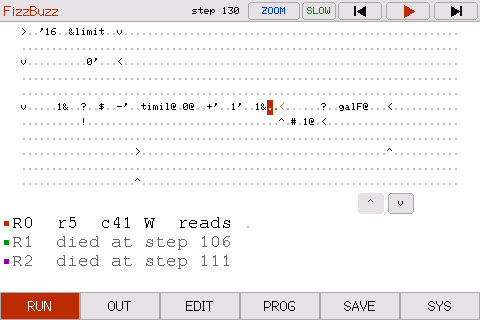
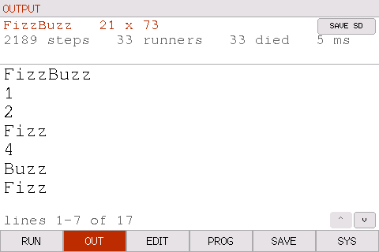
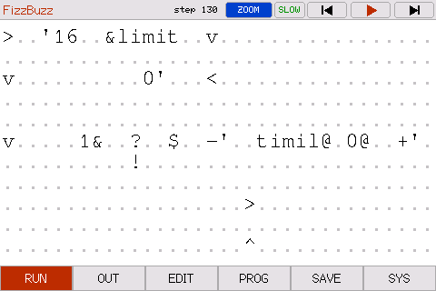

# pIRCIS

An IRCIS interpreter for a Freenove FNK0114S — a 4.0" 320x480 ST7796 touch
display, driven landscape at 480x320. Choose a program, watch the runners walk
it a step at a time, and edit it on the device.

The `p` is for pocket.

IRCIS — "I Run Chars I See" — is a 2D esolang by
[Arjun Nair (batman-nair)](https://github.com/batman-nair/IRCIS). The program is
a grid, one instruction per cell; a runner walks it in a straight line until
told to turn, and can split into several runners at once.

| | |
|---|---|
|  |  |
| A program part-way through, with the runners listed underneath. | Its output, a page at a time, above the run's own numbers. |
|  |  |
| `ZOOM` for a program too wide to read whole. | The editor, with the characters IRCIS accepts. |
|  |  |
| The bundled examples, and a new program at any size. | Settings and diagnostics. |

## Getting started

```bash
git clone https://github.com/jamesleaver/pIRCIS.git
cd pIRCIS
brew install platformio sdl2
```

SDL2 is only for the desktop emulator; leave it out if you are only flashing a
board. On Linux use your own package manager (`pip install platformio`,
`apt install libsdl2-dev`) — nothing else differs.

Then pick one:

```bash
pio run -e st7796 -t upload -t monitor   # flash a board and watch the console
pio run -e emulator -t exec              # run it on your Mac, no hardware
cd host && make test                     # the tests: no PlatformIO, no board
```

The first build fetches the ESP32 toolchain and LovyanGFX, so it needs network
that once. Nothing else has to be generated: a plain clone builds and runs as
it stands.

If the display stays dark or the colours look inverted, that board has the
other panel controller — use `-e ili9488`. If `upload` cannot find the board,
check `pio device list`: if the port is not there at all, the USB-serial driver
is missing rather than anything being wrong with PlatformIO.

## Using it

Six tabs along the bottom: **RUN**, **OUT**, **EDIT**, **PROG**, **SAVE**,
**SYS**.

### Load a program

**PROG** lists the seven bundled examples — Hello World, Binary, Factors,
Calculator, FizzBuzz, Racetrack, Options — with the size of each. Tap one and it
loads; its name then appears as the title of the RUN page. **New program...**
at the bottom gives you a blank grid at any size up to 32 x 96, every cell a `.`
(the blank).

### Run it

**RUN** shows the grid and the transport, right-aligned in the status bar:

| | |
|---|---|
| `\|◀` | reload the program and start again |
| `▶` / `\|\|` | play, or pause |
| `▶\|` | run to the end as fast as it will go |

Three big targets, because those are the ones you reach for at speed. Two more
— step back and step forward, one step at a time — can be added with
**SYS > STEP BUTTONS**; the five then share the same strip and each is smaller.

Tapping the **RUN** tab while you are already on it plays, or pauses if it is
already going — the tab reads `PAUSE` while a run is in progress to say so.

The speed button cycles **SLOW** (about 3 steps a second), **FAST** (about 25),
**RAPID** (about 2000) and **FULL**. At SLOW each runner leaves a fading trail,
which is what makes its path visible; at the faster settings a runner crosses
hundreds of cells between frames and trails are skipped.

A program too wide to read gets a **ZOOM** button. Zoomed in you see 34 columns
at four times the area; drag to pan, and the view follows the active runner —
across and down — until you drag it, after which it stays where you put it.

Under the grid sits either nothing, the runner list, or the output as it is
printed — **SYS > RUN VIEW** chooses, and `NONE` is the default. Both readouts
scroll with the `^` and `v` buttons when there is more than fits.

### Read the output

When a run finishes the device goes to **OUT** on its own. The heading gives the
program's name and size, and underneath it how the run went: steps, runners,
how many died, and how long it took. If the output is longer than the page,
arrows on the right page through it and the footer says which lines you are
looking at. **SAVE SD** writes the whole run to the card.

### Edit it

**EDIT** is a text editor for the loaded program. Tap a cell to put the cursor
there, or use the arrows the cursor carries, then type: the keyboard is the
characters IRCIS accepts, and the cursor advances as you go. `.` is the blank,
so it doubles as delete. Every edit re-runs immediately.

Keys that are not base64 digits take a lighter face. Seven letters —
`v V + / r R p` — are *also* IRCIS commands, so they keep the base64 face and
only their glyph changes colour: the key is still a digit, it just does two
jobs.

The status bar carries the program's name, its size, a `ZOOM` toggle and
**SAVE**. The name and size are buttons — one renames the program, the other
reshapes it — and SAVE writes it to the SD card under that name, so renaming
and saving sit next to each other. Saving over the file the program came from
just saves; saving over a different one asks first.

### Keep it

**SAVE** lists the programs on the card. Tap one to load it, or **SAVE AS** to
write the current program under a new name. They are plain `.txt`, one row per
line, so they move on and off with any computer.

### Settings

**SYS** has WiFi, SD logging (when on, every completed run is written to the
card), touch recalibration, a day/night palette, the entry point, whether the
transport carries its step buttons, the About
pages, and a live diagnostics panel — free heap, largest allocatable block,
steps per second, and whether the run read anything out of bounds. **RESET ALL
DATA** returns the device to how it shipped.

**START POINT** decides where execution begins. On `FIXED` it is always row 0,
column 0, heading east. Set it `FREE` and tapping a character on RUN starts the
program there; tapping it again turns it, and a chevron shows which way the
runner will leave.

## Over serial and over WiFi

The serial console (115200) drives the same working grid as the screen:

```
grid          print the loaded program
cell 3 12 v   set one cell
load          push the edits into the interpreter
run
out           print what it produced
report        the whole run: program, output and statistics
```

`help` lists the rest. Output is mirrored to serial as it is produced, so a
long run can be watched from a laptop.

`SYS > WIFI` serves the device over the local network: the last run, an
editable copy of the loaded program (paste one in and it runs on the device),
the programs on the SD card, the saved outputs, and the preset slots. Programs
and presets can be loaded onto the device from there as well as read.

## On your Mac, without hardware

`pio run -e emulator -t exec` builds the **actual firmware** — the same
interpreter, the same UI, the same console — against an SDL2 window standing in
for the panel. The mouse is the touch screen; stdin is the serial port. Only a
thin platform layer differs between the two builds, so what you exercise on the
Mac is what runs on the board.

Three commands exist only there, and make the UI scriptable:

```
tap <x> <y>        synthesise a touch
shot run.ppm       dump the panel framebuffer
page /outputs      render a web page and print it
```

There is also a command-line runner with no display at all:

```bash
cd host && make
./sk_emu --grid myprogram.txt --stats
./sk_emu --visits        # the execution/direction map of every cell
```

## Under the hood

The interpreter is a **port, not a reimplementation**: `lib/ircis/` is
batman-nair's IRCIS with the filesystem, iostreams and unbounded allocations
taken out and nothing else changed. That matters because a program's behaviour
can depend on how many steps it takes, so an interpreter that is merely
functionally equivalent would not be safe to trust with one.

So the port is checked rather than assumed. `cd host && make test` builds the
same core for macOS and asserts that every bundled program loads at the shape
its table declares, runs to completion, reads nothing out of bounds, and
survives the editing model. `tools/ui_regression.sh` drives the emulator
through a fixed tap sequence and compares ten screens byte for byte.

```
lib/ircis/    the interpreter core -- no filesystem, no iostream, bounded memory
lib/program/  the program model -- variable-size grid, revertible
lib/pack/     SHA-256, TEA-CBC, and the content pack they open
src/          firmware: display, touch UI, run task, NVS, SD, web view
host/         command-line runner and tests (plain Makefile)
```

Build output goes to `~/.cache/pircis/build`, deliberately outside any
cloud-synced folder: a file provider can re-materialise a stale object
underneath a running build.

*(Some macOS Command Line Tools installs ship libc++ only inside the SDK, where
clang does not look. Both builds detect that and work around it.)*

## One more program

There is a program on this device that the list does not show.

It is in `lib/pack/`, encrypted, and two words open it — the key is
`SHA256(SHA256(a) || SHA256(b))` and the cipher is TEA-CBC. Nothing derived from
those words is stored anywhere, so there is no digest here to test a guess
against: the only test is whether what comes out starts with the right four
bytes, which is why those bytes sit *inside* the ciphertext rather than in front
of it. `Store::setWifi` is where a guess gets tried, so any route that sets the
WiFi credentials counts, including the serial console.

That is the whole of what this repository knows. The words are not in it, the
tool that built the pack takes them as arguments and writes them nowhere, and
the contents are not reconstructible from anything here.

It is obfuscation, not security. It hides a surprise from someone holding the
device; it is not protecting anything.

## Copyright

The firmware, UI, host tools and tests are **Copyright (c) 2026 James Leaver**,
released under the [MIT License](LICENSE).

Two things here are not mine: `lib/ircis/`, the interpreter core, is Arjun
Nair's ([batman-nair/IRCIS](https://github.com/batman-nair/IRCIS), MIT — see
[`lib/ircis/LICENSE`](lib/ircis/LICENSE)); and LovyanGFX, fetched at build time
rather than vendored, is lovyan03's (FreeBSD).
