# pIRCIS

A pocket computer for writing and watching
**[IRCIS](https://github.com/batman-nair/IRCIS)** programs, running on a
cheap 4" ESP32 touchscreen. Pick a program, hit play, and watch the runners
walk across the grid one step at a time. Edit it on the device with a stylus.
No computer needed once it is flashed.

The `p` is for pocket.

IRCIS stands for *"I Run Chars I See"*. It is a two-dimensional esolang by
[Arjun Nair (batman-nair)](https://github.com/batman-nair/IRCIS). A program is
a grid of characters, one instruction per cell. A *runner* walks it in a
straight line until something tells it to turn, and it can split into several
runners going different ways at once.

<p align="center">
  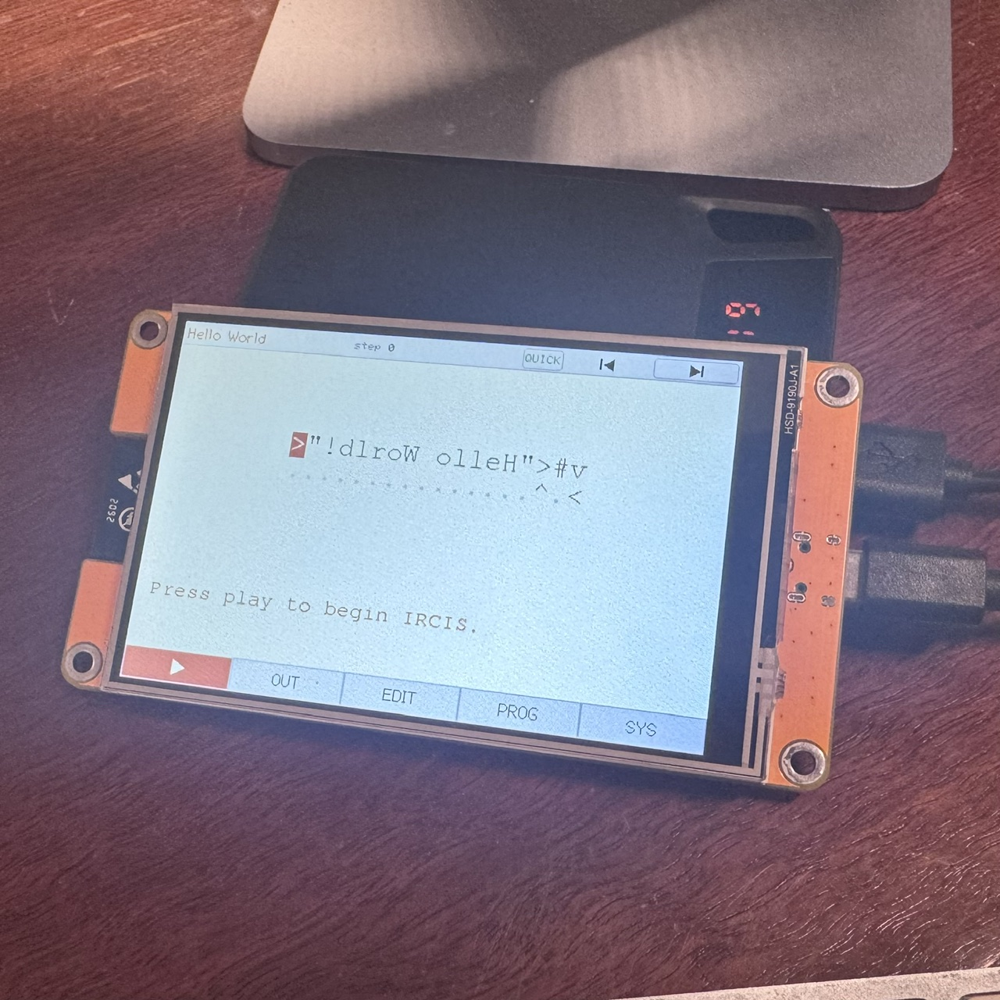
</p>

<p align="center">
  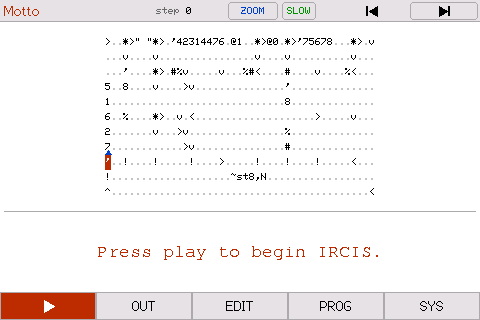
</p>

That second one is a real program running. Five runners walk the shape of the
letters and spell out **IRCIS** as they go, then the program prints what it
stands for. They only exist as the paths the runners take, and nothing in the
grid spells them out.

### New here?

**[Learn IRCIS](LEARN.md)** teaches the language from scratch and builds up to
writing your own programs. Every example in it is a real program you can run.

**[Try it without a board](#run-it-on-your-computer-instead).** The emulator
runs the whole thing in a window on your computer, so you can have a go before
buying anything.

## What you need

Nothing at all to start with, if you use
[the emulator](#run-it-on-your-computer-instead). For the real thing:

- A 4.0" 320x480 ESP32 touch display. A Freenove FNK0114S, or any of the
  "cheap yellow display" boards of that size. Driven landscape at 480x320.
- A USB cable.
- Optionally a microSD card, for saving programs and run logs.

These boards ship with one of two display controllers. Everything here was
built against an **ST7796**, which is the one I have. There is an `ili9488`
build too, but **I have never run it on hardware.** If you have one of those
boards I would love to know whether it works.

## Getting it on the board

The easiest way is to build it yourself:

```bash
git clone https://github.com/jamesleaver/pIRCIS.git
cd pIRCIS
brew install platformio sdl2
pio run -e st7796 -t upload -t monitor
```

SDL2 is only for the emulator. Skip it if you just want to flash a board. On
Linux, `pip install platformio` and `apt install libsdl2-dev`.

If the screen stays dark or the colours look wrong, you have the other panel:
use `-e ili9488` instead. If `upload` cannot find the board, check
`pio device list`. If the port is not there at all you are missing the
USB-serial driver, not anything to do with PlatformIO. And if it sits on
`Connecting.....` forever, hold the **BOOT** button, tap **EN/RST**, then let go
of BOOT.

There are also prebuilt archives on
[Releases](https://github.com/jamesleaver/pIRCIS/releases) if you would rather
not build. Grab the zip for your panel plus `SHA256SUMS`, check it, unzip it,
and run `./flash.sh`. With no arguments it lists the ports it can see.
Flashing that way needs [esptool](https://pypi.org/project/esptool/), and on
recent macOS you will need it in a virtual environment:

```bash
python3 -m venv ~/.venvs/esptool
source ~/.venvs/esptool/bin/activate
pip install esptool
```

## Run it on your computer instead

You don't need a board to try any of this. The emulator runs the real firmware
in a window on your computer. Same interpreter, same screen, same programs. The
mouse works as the touchscreen.

```bash
brew install platformio sdl2
git clone https://github.com/jamesleaver/pIRCIS.git
cd pIRCIS
pio run -e emulator -t exec
```

On Linux, `pip install platformio` and `apt install libsdl2-dev` instead of the
brew line.

This really is the same code that runs on the board. Only a thin layer
underneath it differs. Every picture on this page came out of the emulator.

**Type with your own keyboard.** Set `SYS > KEYBOARD` to `REAL`. The on-screen
keys disappear and you type straight into the grid. Arrows move the cursor and
backspace writes a blank. Your program gets those three rows back, which is
about seven more lines on screen.

Whatever you type in the terminal goes to the device as if it had come down the
serial cable, so `help` will list what it can do. Four commands only work here:
`tap <x> <y>` presses the screen for you, `key <char>` types for you,
`shot run.ppm` saves a picture of it, and `page /outputs` prints one of the web
pages.

### Driving it from the keyboard

Set **SYS > KEYBOARD** to `REAL` and the on-screen keyboards go away, because
you have a real one. The shortcut list comes up when you switch it over, and
`F1` brings it back.

| Key | What it does |
|---|---|
| Tab, Shift-Tab | the next page, the page before |
| Arrows | move between the controls on the page |
| Space, Enter | press the one the ring is on |
| Esc, or `c` | close what is open |
| `p` | play or pause |
| `f`, `b` | forward a step, back a step |
| `r` | back to the start |
| `e` | run to the end |
| `s` | speed |
| `z` | ZOOM or WIDE |
| `n` | rename the program |
| `x` | delete the program the ring is on, in PROG |
| Ctrl/Cmd `V` | paste a program in from the clipboard |
| F1 | the shortcut list |

On RUN the arrows scroll the view. If **SYS > GRID TAP** is set to inspect
cells or to move the start point, they move between cells instead and Space
does whatever that setting says.

In the editor the letters go into the program, so the commands above do not
apply there. Ctrl or Cmd with `S`, `Z`, `Y`, `N` and `G` save, undo, redo,
rename and switch the grid view. Ctrl or Cmd with Shift and `?` brings up the
shortcut list, `?` being the symbol on the editor's help button.

The window itself answers to Alt-`R` and Alt-`L` to rotate and Alt-`1` to
Alt-`6` to scale. Those need Alt so that `r`, `l` and the digits stay ordinary
characters in a program.

There is a version with no window at all, for running a program and looking at
what it did:

```bash
cd host && make
./sk_emu --grid myprogram.txt --stats
./sk_emu --visits
```

## Using it

Five tabs along the bottom: **RUN**, **OUT**, **EDIT**, **PROG**, **SYS**.

### PROG — pick a program

Sixty-one programs come with it, sorted into folders. Tap a folder to go in,
**Back** to come out.

| | |
|---|---|
| 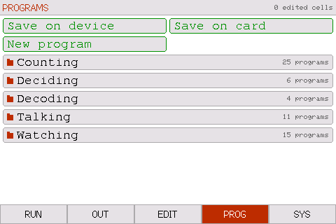 | 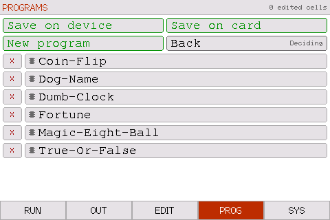 |

Programs live in two places, the board's own flash and the SD card, and the
list merges them. A chip mark means it is on the device, a notched card means
it is on the SD card. Tap one to load it. `X` deletes it.

The two **Save** rows write the current program to either store, into whichever
folder you are looking at. **New program...** gives you an empty grid at any
size up to 32 x 96.

Nothing here is precious: edit a built-in program, save over it, rename it,
delete it. `SYS > RESTORE BUILT-INS` puts the originals back and leaves
anything you made alone.

### RUN — watch it go

The **RUN** tab is also the play button. While you are on that page it shows
`▶`, or `⏸` once something is going, and tapping it starts or pauses. It is the
biggest target on the screen, which is deliberate.

<p align="center">
  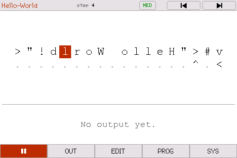
</p>

The rest of the transport sits in the status bar: reset back to the start,
step, and run-to-the-end. Turn on **SYS > STEP BUTTONS** for two more,
step back and step forward, so you can walk a program one tick at a time and
back again. Stepping back rebuilds and replays, so it is instant early in a run
and slow once you are thousands of steps in.

Four speeds: **SLOW** (about 3 steps a second), **MED** (25), **QUICK** (2000)
and **FULL**. At SLOW each runner leaves a short fading tail, which is how you
follow what it is doing. However fast you set it, a run always starts slowly
for a second so you can see the runners set off. FULL skips that, on the basis
that asking for FULL means you want the answer and not the show.

**ZOOM** shows the program at the editor's size, twenty columns and seven
rows at a time; **WIDE** shows eighty columns and twelve rows. A program that
fits ZOOM whole is simply shown that way. Whichever you pick, EDIT shows the
program at the same size and in the same place, so moving between the two
pages moves nothing. Small arrows on the grid's edges page through a program
larger than the window, and only appear on the sides where there is more to
see. Opening EDIT pauses a run.

### OUT — read what it printed

<p align="center">
  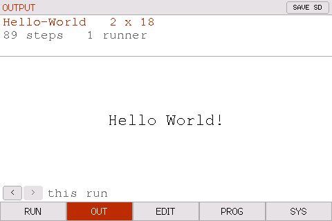
</p>

When a run finishes the **OUT** tab gets a dot and the RUN tab turns into a
go-again arrow.

You can watch output being generated live on the **OUT** tab while a program is
running.

It also keeps the **last ten runs**. The `<` and `>` buttons at the bottom step
back through them, each with what it printed and how many steps it took.

<p align="center">
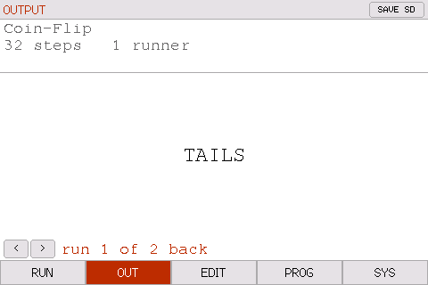
</p>

**SAVE SD** writes whichever run you are looking at to the card. It only
appears when there is a card in the slot.

### EDIT — change it with your finger

Tap a cell to put the cursor there, then type. `.` is the blank, so it doubles
as delete. The grid here is the RUN page's grid at the same size and position,
with the same ZOOM button, so nothing shifts when you switch between them; the
edge arrows scroll a program larger than the window, and the cursor stays
where it was.

| | |
|---|---|
| 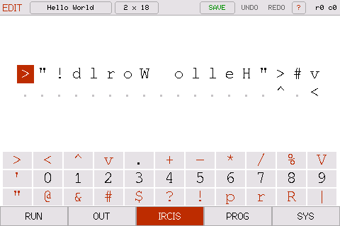 | 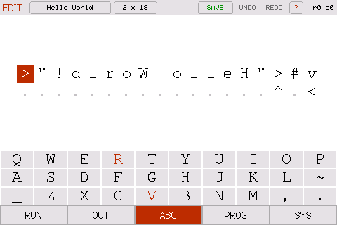 |

**`?`** in the status bar opens the command list, so it is one tap away while
you are writing.

The size button next to the name reshapes the program, and has two pages. The
first adds or removes rows and columns at a named edge, which is the one that
matters when a runner starts at 0,0: it says whether a new row lands above the
program or below it. The second inserts a row or column before a numbered one,
or deletes that one, for making room in the middle of a program rather than at
its edges. Those changes happen as you press them rather than on OK, so that
page has UNDO and DONE instead: UNDO takes them back a step at a time, and
reads CANCEL until there is something to take back. Delete asks twice as well,
since it throws cells away.

The main keyboard is the thirty-three characters you actually write IRCIS with.
Tapping **EDIT** while you are already on it cycles to the capitals and then the
lower case, laid out QWERTY. The tab tells you which keyboard you are looking
at.

- **UNDO / REDO** go back through the last 128 cell edits.
- The size button asks which **side** to add to or take from: top, bottom, left
  or right. "Eleven rows" never said whether the new one lands above your
  program or below it.
- **PROG** grows a **Discard changes** row whenever there is something to throw
  away.

### SYS — settings

<p align="center">
  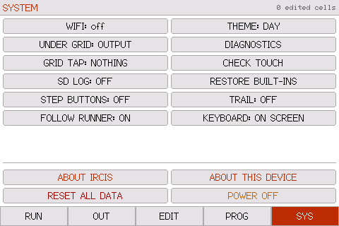
</p>

WiFi, what sits under the grid, what tapping the grid does, SD logging, a
day/night palette, and restoring the built-ins.

**TRAIL** keeps every cell a runner has crossed tinted, so the whole path
builds up on screen instead of fading behind it. The same thing `t` in a
program's tag asks for.

**FOLLOW RUNNER** decides whether the view chases the runner through a program
larger than the window. On for a program too big to see at once; off when you
have put the view somewhere and want it to stay there. Scrolling by hand holds
the view still until the next run either way. A program can ask for it off with
`h` in its tag.

**CHECK TOUCH** asks you to tap three rings and tells you how far out the worst
one was, then offers to recalibrate. A key is about 43 px wide, so within six
pixels is fine and much past fourteen is worth redoing.

**DIAGNOSTICS** is live while you watch it: free heap, steps per second, and
whether the run read anything out of bounds. If a runner died of anything other
than reaching `!` or walking off the edge, it is listed there with the cell it
was standing on and the interpreter's own words for what went wrong, such as
`runner 0 died at row 0, col 7: Variable name 'size2' should contain only
alphabets`. Every death is written to the serial console as well.

## The programs

Sixty-one of them. The full list is in [`programs/`](programs/).

| | |
|---|---|
| 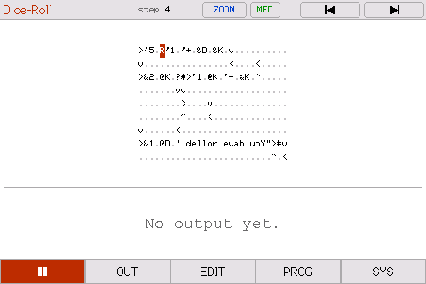 | 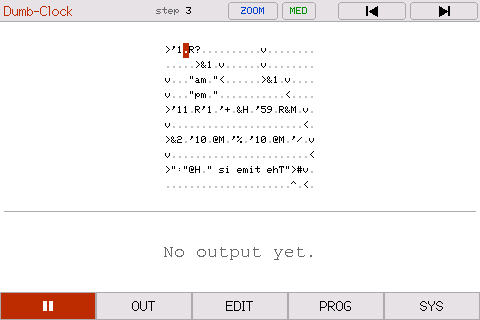 |
| **Dice Roll** — rolls, prints the number, then puts exactly that many runners into a ring, so you can count the answer going round. | **Dumb Clock** — invents a plausible time and reads it out in words. |
| 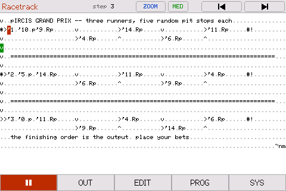 | 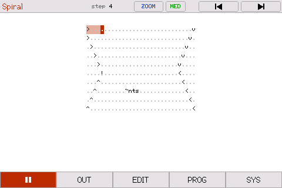 |
| **Racetrack** — three runners, five random pit stops each. The finishing order determines the winner. | **Spiral** — one runner winding inward over every cell. Eight programs print nothing at all and are just worth watching. |

A few are hiding what they do until you run them:

<p align="center">
  
</p>

That is the whole of **Insult Machine**. Every word in it is carried as a
number, because `%` prints an integer as base64 characters, so there is not a
letter to read anywhere in the grid.
**Dog Name** does the same but picks its numbers with two coin flips, and
**Warning** does not even write the numbers down: each one is a quotient and a
remainder, multiplied back out as it runs.

**Morse Decoder** turns morse back into a word. The whole top row is yours: put
one code per letter after the `'0.`, left to right. `1` is a dit and `2` is a
dah, so `'1111.'1.'1211.'1211.'222.` gives HELLO. The row underneath says so on
the device, with arrows pointing at where to type. It walks a binary tree for
each letter. Five letters is the ceiling: the answer is built up in a single
integer, and an int32 holds exactly five base64 characters.

The rest are counting loops, times tables, one-of-four answer machines, the
Morse alphabet on two screens, and ten correct digits of π out of Machin's
formula, in a language with 32-bit integers and no arrays.

## Telling a program how to show itself

A program can say how it wants to be displayed, in one short tag written
anywhere in the grid. A tilde, then single letters:

```
under the grid:  n  nothing    d  runner readout
speed:           s  slow   m  med   q  quick   f  full
path:            t  keep every cell a runner has crossed tinted
hold the view:   h  do not follow the runners while it runs
start position:  <col>,<row> and one of N E S W
```

So `~nm3,1N` means: nothing underneath, medium speed, start at column 3 row 1
heading north. Order does not matter. Anything you leave out goes back to the
default, so most programs need no tag at all.

`t` is the interesting one. Normally a runner shows a short tail and the cells
behind it go back to normal. With `t`, every cell any runner has stood on stays
tinted, so the whole path builds up and stays on screen. That is what makes the
`h` is the other one worth knowing. In a program larger than the window the
view normally follows the runner, scrolling to keep it on screen. For a program that draws something,
that moves the picture out from under you; `h` leaves the view where you put
it. There is a switch for it on SYS as well, under **FOLLOW RUNNER**.

Add `t` to
[Spiral](programs/Watching/Spiral.txt) (Watching) or
[Snake](programs/Watching/Snake.txt) (Watching) and you get the same effect.

None of the tag characters is an IRCIS command, so a runner that crosses one
just steps over it. A tag can sit on any blank cell in the middle of a program.
Type it in on the EDIT page and save the program to keep it.

## Writing your own

| Character | What it does |
|:---:|---|
| `< > ^ v` | Move the runner |
| `+ - * / %` | Arithmetic, in *integer* mode |
| `#` | Print the top of the stack |
| `%` | Print the top of the stack as base64 characters |
| `$` | Newline |
| `!` | This runner stops |
| `.` and space | Blank — the runner walks over it |
| `"` | Toggle *stack* mode: characters get pushed as they are |
| `'` | Start a number; a blank ends it |
| `?` | If the top of the stack is non-zero carry on, otherwise turn |
| `*` | Split into more runners |
| `@n` / `&n` | Push the n'th item / pop n items |
| `@name` / `&name` | Push a variable / set one |
| `r` / `R` | Random 0 or 1 / random up to a limit |
| `p` | Pause this runner for n ticks |

Four things are easy to get wrong:

- **Arithmetic takes the top of the stack as the left operand.** Push 10 then 3
  and `'-.` gives -7, not 7.
- **`?` does not pop.** It looks at the top and leaves it there, so a branch has
  to clear up after itself.
- **Text is pushed, so it comes out backwards.** Write it reversed in the grid.
- **A cell holds one instruction.** A path that crosses one of its own turns
  will take that turn again and loop for ever.

The full command list and the language rules are in
[Arjun Nair's README](https://github.com/batman-nair/IRCIS), which is where I
learned all of this.

## Over serial and over WiFi

The serial console (115200) drives the same grid as the screen:

```
grid          print the loaded program
cell 3 12 v   set one cell
run
out           print what it produced
report        the whole run, with statistics
```

`help` lists the rest. Output is mirrored to serial as it appears, so you can
watch a long run from a laptop.

`SYS > WIFI` serves the device on your network: the last run, an editable copy
of the loaded program, both program stores, and the saved outputs. You can
paste a program in from a browser and it runs on the device.

**There is no password on any of it.** Anyone who can reach the board can read
what is on the card and write a program onto it. That is fine for something on
your own desk, but it should be your choice. Turn WiFi off on a network you
share.

## What's inside

```
lib/ircis/    the interpreter core
lib/program/  the program model -- variable-size grid, revertible edits
lib/pack/     SHA-256, TEA-CBC, and the content pack they open
src/          firmware: display, touch UI, run task, NVS, SD, web view
host/         command-line runner and tests
```

`lib/ircis/` is **a port rather than a reimplementation**: batman-nair's IRCIS
with the filesystem, iostreams and unbounded allocations taken out, and nothing
else changed. A program's behaviour can depend on how many steps it takes, so
"functionally equivalent" would not be good enough.

`cd host && make test` builds the same core for macOS and checks that every
bundled program loads at the size its table claims, runs to completion, and
reads nothing out of bounds. `tools/ui_regression.sh` drives the emulator
through a fixed set of taps and compares the screens byte for byte.
`tools/make_shots.sh` regenerates every picture on this page.

Build output goes to `~/.cache/pircis/build`, deliberately outside any
cloud-synced folder. A file provider can quietly hand a stale object to a
running build.

## One more program

There is an IRCIS program on this device that the list does not show.

It is encrypted, and two words open it. Enter them correctly and you get an
easter egg.

## Copyright

The firmware, UI, host tools and tests are **Copyright (c) 2026 James Leaver**,
released under the [MIT License](LICENSE).

Two things here are not mine. `lib/ircis/`, the interpreter core, is Arjun
Nair's ([batman-nair/IRCIS](https://github.com/batman-nair/IRCIS), MIT — see
[`lib/ircis/LICENSE`](lib/ircis/LICENSE)). LovyanGFX, fetched at build time
rather than vendored, is lovyan03's (FreeBSD).
